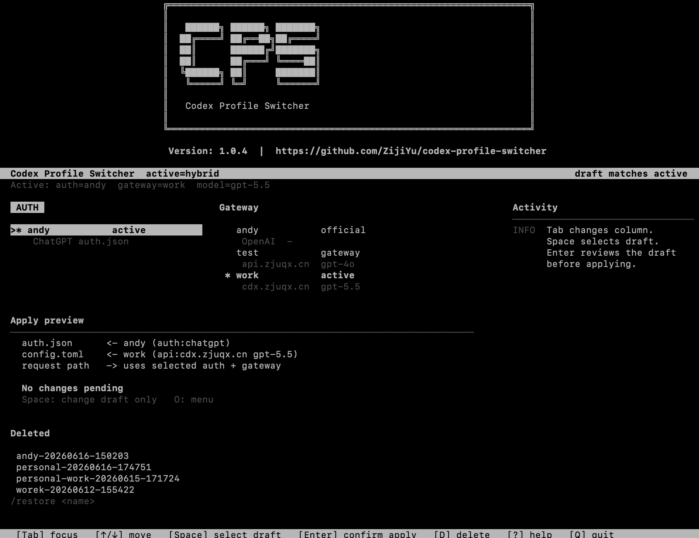

# CPS - Codex Profile Switcher

[English](README.md) | [简体中文](docs/README.zh-CN.md) | [日本語](docs/README.ja.md) | [한국어](docs/README.ko.md)

```text
╔════════════════════════════════════════════════════════════════╗
║   CPS - Codex Profile Switcher                                ║
╚════════════════════════════════════════════════════════════════╝

Version: 1.0.5
```

> CPS is a tiny terminal tool for using official Codex auth login with gateway forwarding.
>
> The core flow is: log in with Codex/ChatGPT auth, then route model requests through a stable gateway provider.

It keeps official auth and gateway routing separate:

```text
Auth login    -> auth.json / ChatGPT login
Gateway route -> config.toml / provider / model / base_url
```

Then it applies the pair without manually editing `~/.codex`.

```text
$ cps
Auth login + Gateway route -> ~/.codex
```

## What CPS is for

Use CPS when you want to:

- switch between personal and work Codex accounts;
- keep multiple API keys or OpenAI-compatible routes;
- use one ChatGPT login state with a different gateway route;
- avoid manually copying `auth.json` and `config.toml` in `~/.codex`;
- keep project-specific Codex configs separated.

## Download and Install

### Option 1: Install directly from GitHub

This is the fastest way if you only want to use CPS:

```bash
python3 -m pip install "git+https://github.com/ZijiYu/CPS.git"
```

After installation, check that the command is available:

```bash
cps --help
```

If your terminal says `cps: command not found`, your Python script directory is probably not in `PATH`. You can still run CPS with:

```bash
python3 -m codex_profile_switcher.cli --help
```

### Option 2: Download the source code and install locally

Use this method if you want to read the code, edit it, or run the latest local version.

Clone with Git:

```bash
git clone https://github.com/ZijiYu/CPS.git
cd CPS
python3 -m pip install -e .
```

Or download it from the GitHub page:

```text
Code -> Download ZIP -> unzip it -> open the extracted folder in Terminal
```

Then install from the extracted folder:

```bash
cd CPS
python3 -m pip install -e .
```

The project exposes these commands after installation:

```text
cps
codex-profiles
```

`cps` is the recommended command.

### Optional: install in an isolated environment with pipx

If you use `pipx`:

```bash
pipx install "git+https://github.com/ZijiYu/CPS.git"
```

## Start

Open the TUI:

```bash
cps
```



Main flow:

```text
1. Choose one Auth login
2. Choose one Gateway route
3. Press Enter to review the draft pair, then confirm to apply
4. Press R to Restart Codex
```

Create profiles from the TUI:

```text
O Menu -> New Auth Login
O Menu -> New Gateway Route
```

## CLI Quick Commands

```bash
cps init auth personal
cps init route work
cps mix personal work
cps doctor
cps restart
```

Custom API route:

```bash
cps route custom \
  --base-url https://your-endpoint.example.com/v1 \
  --model gpt-5.5 \
  --api-key sk-...
```

Restore official route:

```bash
cps route official --model gpt-5.5
```

## Where Files Live

```text
~/.codex                 active Codex config
~/.codex-profiles        saved CPS profiles
~/.codex-profiles/.cps.lock serializes CPS writes
~/.codex-profiles/<profile>/profile.json non-secret profile metadata
~/.codex-profiles/deleted reversible deletes
~/.codex-profiles/backups switch-time backups
```

## Diagnose

```bash
cps doctor
```

`doctor` checks for common switch-time problems: missing Codex CLI, reserved
provider overrides such as `[model_providers.OpenAI]`, stale last-mix pointers,
missing auth files, and custom routes that may need a Codex restart before the
model picker refreshes.

## Troubleshooting

### `cps: command not found`

Try:

```bash
python3 -m codex_profile_switcher.cli --help
```

If that works, the package is installed but your Python scripts directory is not in `PATH`.

### `pip install -e .` cannot find the project

Make sure you are inside the repository root. You should see `pyproject.toml` in the current folder:

```bash
ls
```

Expected files include:

```text
pyproject.toml
README.md
src/
```

### You installed from ZIP but `cd CPS` fails

GitHub ZIP downloads may extract to a folder such as:

```text
CPS-main
```

Use the actual extracted folder name:

```bash
cd CPS-main
python3 -m pip install -e .
```

## Uninstall

```bash
python3 -m pip uninstall codex-profile-switcher
```

CPS stores saved profiles under `~/.codex-profiles`. Uninstalling the Python package does not automatically delete your saved profiles.

## Star History

[](https://www.star-history.com/?type=date&repos=ZijiYu%2FCPS)
